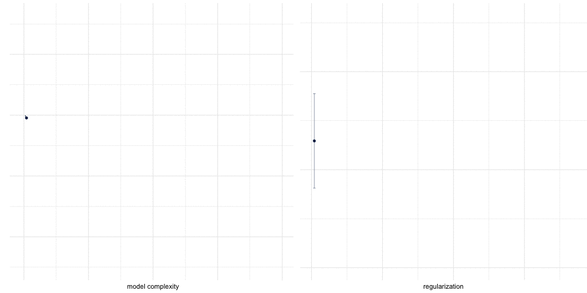

```{r setup, include=FALSE}
options(htmltools.dir.version = FALSE)
```

```{r xaringan-themer, include=FALSE, warning=FALSE}
library(xaringanthemer)
style_duo_accent(
  primary_color = "#2d708e",
  secondary_color = "#230433",
  title_slide_background_color = "#ffffff", #"#042333",
  title_slide_background_image = "../../../files/theme/LSE/sign_reflection.jpg",
  title_slide_background_size = "cover") #or contain
```

```{r xaringanextra, include=FALSE, warning=FALSE}
library(xaringanExtra)
xaringanExtra::use_animate_all("slide_left")
xaringanExtra::use_tile_view()
xaringanExtra::use_panelset()
xaringanExtra::style_panelset_tabs(font_family = "inherit")
```

```{r tidyverse, include=FALSE, warning=FALSE}
library(tidyverse)
theme_set(theme_minimal(base_size = 22))
```

<style type="text/css">
.remark-slide-content {
    font-size: 1.2rem;
    padding: 1em 4em 1em 4em;
}
</style>


class: center, middle

# Welcome!

### ST 310 - Machine Learning

London School of Economics

Michaelmas term 2021

???

This is the very first, introductory video for week 1

Provide context

Set expectations

---
class: inverse, center, middle

# Please allow me

# to introduce

# myself

I'm Joshua Loftus

???

I'm the lecturer

For seminars, help from the very capable Phil Chan

---
class: bottom

.pull-left[


]

.pull-right[

&nbsp; 

&nbsp; 
&nbsp; 

- New to LSE! 
- Used to teach at NYU
- Cambridge postdoc
- Stats PhD from Stanford
- Reproducibility, fairness


]

???

I am a person in the world, not just on lecture slides!

---

# About the course

- Course info
- Quick preview
- Teaching/course philosophy


???

Animation shows lasso, a method we'll learn about later

---
class: inverse, center, middle

# Course info

---

# Format

- *Mostly* self-contained -- ask if you need help!
- Videos on Moodle each week
- Seminars: pre-work, Zoom links on Moodle
- Course page (links, slides, misc. notes)
  - http://ml4ds.com/
- Forum (participation = learning)
  - http://discourse.ml4ds.com/
- Readings / supplemental references
  - **ISLR** [Introduction to Statistical Learning](https://statlearning.com/) 
  - **ESL** [Elements of Statistical Learning](https://web.stanford.edu/~hastie/ElemStatLearn/)
  - **CASI** [Computer Age Statistical Inference](https://web.stanford.edu/~hastie/CASI/)
  - **Mixtape** [Causal Inference: The Mixtape](https://mixtape.scunning.com/index.html)
  - **R4DS** [R for Data Science](https://r4ds.had.co.nz/)

---

# Assessments

As described in the [course listing](https://www.lse.ac.uk/resources/calendar2020-2021/courseGuides/ST/2020_ST310.htm)

- Formative
  - Problem sets every 2 weeks
- Summative
  - Final project (30%)
  - Summer exam (70%)

(I believe the summer exams may be remote?)

(Whatever the university decides, that's what we're doing)

### Let's all do our best, and be understanding!

---
class: inverse, center, middle

# Quick preview

---

.panelset[
  .panel[.panel-name[Code]
  
```{r plot-example, fig.show = "hide"}
library(gapminder)
gdp_data <- gapminder %>%
  filter(year == max(year))

life_exp_plot <- 
  ggplot(gdp_data, `aes`(x = gdpPercap, y = lifeExp)) +
  `geom_point`(aes(color = continent,
                   shape = continent,
                   size = pop)) +
  scale_color_viridis_d(option = "magma",
                        direction = -1,
                        begin = .2, end = .8)

life_exp_plot +
  `stat_smooth`(formula = y ~ x, method = "loess", span = 1)
```
  
  
  ]
  .panel[.panel-name[Plot]
```{r ref.label="plot-example", fig.width = 9, echo=FALSE}
```
  
  ]

  .panel[.panel-name[Modify]
  
```{r plot-example2, fig.show = "hide"}
life_exp_plot +
  scale_x_log10() +
  stat_smooth(formula = y ~ x, method = "lm") +
  xlab("GDP per capita") +
  ylab("Life expectancy")
```
  
  
  ]
  .panel[.panel-name[Plot again]
```{r ref.label="plot-example2", fig.width = 9, echo=FALSE}
```
  
  ]
]

???

Preview of some R


Model complexity: nonlinear vs relatively simple (linear) model

Linear model: may not fit the data as well

But! interpretable, one slope to summarize relationship

But! reliable/stable, 


Machine learning allows us to find models with just the right amount of complexity

---
class: bottom


.pull-left[

Source: [xkcd](https://xkcd.com/2048/)
]

https://twitter.com/Reza_Zadeh/status/1045124253006192640


---
class: inverse, center, middle

# Teaching/course philosophy

---

Causality is important

over-imitation

human Understanding, interpretability


