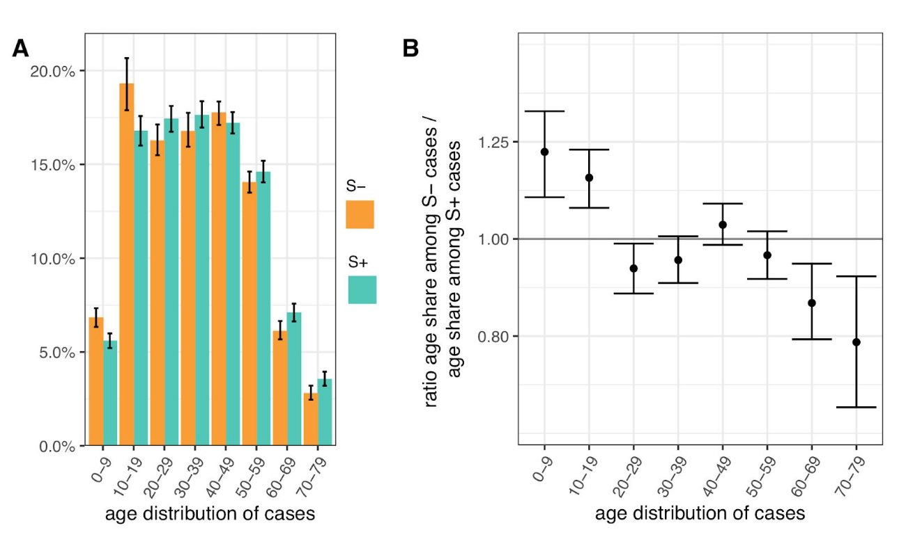

```{r setup, include=FALSE}
knitr::opts_chunk$set(echo = FALSE)
options(dplyr.summarise.inform = FALSE)
library(tidyverse)
library(scales)
library(plotly)
```

## Cases and age across London Boroughs

Using [PHE data](https://data.london.gov.uk/dataset/coronavirus--covid-19--cases) on cases and [ONS data](https://www.ons.gov.uk/peoplepopulationandcommunity/populationandmigration/populationestimates/datasets/populationestimatesforukenglandandwalesscotlandandnorthernireland) for population demographic estimates (age, specifically), we can plot the **rate of new COVID cases since 1 November** compared to the **proportion of each Borough's population under age 20**.

```{r echo = FALSE}
download_filename <- "UK_population.xls"
download.file(
  url = paste0(
    "https://www.ons.gov.uk/file?uri=",
    "%2fpeoplepopulationandcommunity%2f",
    "populationandmigration%2fpopulationestimates",
    "%2fdatasets%2fpopulationestimatesforukenglandand",
    "walesscotlandandnorthernireland%2fmid2019april2020",
    "localauthoritydistrictcodes/ukmidyearestimates",
    "20192020ladcodes.xls"),
  destfile = download_filename)

UK_age_pop <- readxl::read_xls(download_filename,
                                     col_names = TRUE,
                                     sheet = "MYE2 - Persons",
                                     range  = "A5:CQ431")

deleted <- file.remove(download_filename)

n_age_0_19 <- UK_age_pop %>%
  select(num_range("", 2:19)) %>%
  mutate(total = rowSums(.)) %>%
  pull(total)

UK_pop <- UK_age_pop %>%
  select(matches("[A-Z]")) %>%
  mutate(pop_019 = n_age_0_19, pop = `All ages`) %>%
  select(-`All ages`)

london_covid <- read_csv("https://data.london.gov.uk/download/coronavirus--covid-19--cases/151e497c-a16e-414e-9e03-9e428f555ae9/phe_cases_london_boroughs.csv")

london_recent <- london_covid %>%
  filter(date > "2020-11-01") %>%
  group_by(area_name) %>%
  summarize(recent_cases = sum(new_cases))

london_covid_age <- inner_join(
  UK_pop, london_recent,
  by = c("Name" = "area_name")) %>%
  mutate(
    prop_child = pop_019 / pop,
    recent_rate = recent_cases / pop)
```

```{r}
theme_set(
  theme_minimal(
    base_size = 12,
    base_line_size = 1
    )
  )
theme_update(strip.text.x = element_text(size = 14))

london_covid_age %>%
  ggplot(aes(prop_child, recent_rate)) +
  geom_point() +
  xlab("Pop. % under age 20") +
  ylab("Pop. case rate since Nov")
```

I would interpret this plot as a rough summary of some observational data. I'm not going to fit any regression line or do any fancy modeling. But it seems pretty clear that the rate of new COVID cases is lower in boroughs with proportionally less children, and higher in those with more children.

One of the most important caveats about interpreting the above graph is that this is an [ecological correlation](https://en.wikipedia.org/wiki/Ecological_correlation). Since the data has already been aggregated to the borough level relationships will appear more clear than they would be at finer scales of spatial resolution. So, take this plot with a graint of salt.

Also note that this plot does not distinguish cases of the new variant from other cases. However, the focus here is on London where the new variant rapidly took over recently, so the majority of new cases are of the new variant.

```{r echo = FALSE, eval = FALSE}
#Here's an animation from the same data showing **cumulative cases / population over time**. The points only move upward because it's cumulative cases, but you can press play or move the slider to see how the boroughs accumulated cases over time. Mouse over a point to see the name of the Borough.
fig <- inner_join(
  UK_pop, london_covid,
  by = c("Name" = "area_name")) %>%
  group_by(Name) %>%
  mutate(under20 = pop_019 / pop,
         cases = new_cases, # / pop,
         cumulative_cases = cumsum(cases) / pop, #rollsum(cases, 7, fill = NA),
         day = as.character(date)) %>%
  filter(date >= "2020-12-01") %>%
  plot_ly(
    x = ~under20, 
    y = ~cumulative_cases, 
    #size = ~pop, 
    frame = ~day, 
    text = ~Name, 
    hoverinfo = "text",
    type = 'scatter',
    mode = 'markers',
    showlegend = FALSE
  ) %>%
  animation_opts(frame = 200,
                 redraw = FALSE) 

fig
```


## Age group and infection rates

Data from the ONS COVID survey (described in the previous post) has estimated infection rates by age groups. Unfortunately there was no breakdown by age group and region, or by age group and new/old variant. But we can see from this data that the rates have remained consistently higher for school aged children and young adults. These younger groups also experienced the most rapid increase in infection rates in December during the same period that the new variant became more prevalent.

```{r}
download_filename <- "covid_positivity_update.xlsx"
download.file(
  url = paste0(
  "https://www.ons.gov.uk/file?uri=",
  "%2fpeoplepopulationandcommunity%2f",
  "healthandsocialcare%2fconditionsand",
  "diseases%2fdatasets%2fcoronaviruscovid19",
  "infectionsurveydata%2f2020/covid19infection",
  "surveydatasets2020122423122020174305.xlsx"),
  destfile = download_filename)

c19rates_update <- readxl::read_xlsx(download_filename,
                              col_names = TRUE,
                              sheet = "1g",
                              range  = "A7:V49")

deleted <- file.remove(download_filename)

names(c19rates_update) <- c("date", 
do.call(paste, 
expand.grid(
  c("positive", "lower", "upper"),
  c("Age2to10",
    "Age11to15",
    "Age16toAge24",
    "Age25to34",
    "Age35to49",
    "Age50to69",
    "Age70+")
  )
))

c19_long_update <- c19rates_update %>%
  pivot_longer(!date) %>%
  separate(col = name, sep = " ",
           into = c("est", "age")) %>%
  pivot_wider(names_from = est, values_from = value)
```

```{r layout="l-body-outset", fig.width=6, fig.height=4}
c19_long_update %>%
  ggplot(aes(as.Date(date), positive, linetype = age, color = age)) +
  geom_errorbar(aes(ymin = lower, ymax = upper), width = 0, alpha = 0.3) +
  geom_line() +
  scale_color_viridis_d(end = .8) +
  ylab("Percent positive estimates") +
  xlab("")  +
  scale_x_date(breaks = as.Date(c("2020-11-15",
                                  "2020-11-30",
                                  "2020-12-15")),
               labels = date_format("%b %d"))
```

### Update with better data

Thanks to [Dan Cookson](https://twitter.com/danc00ks0n/status/1345093755632758784) who brought my attention to [this data^[Under supplementary data on the side]](https://coronavirus.data.gov.uk/details/download) and pointed out that **some regions which are not currently seeing high infection rates among young people did so earlier in the season**. This is a potential answer to the big open question I ended with before: schools that had outbreaks earlier have some amount of acquired immunity and probably enacted policy and behavior changes. Perhaps these earlier outbreaks among young people also explain the prevalence of a different strain that was predominant before the current variant broke out in the London area. The [previous strain](https://nextstrain.org/groups/neherlab/ncov/S.N501?c=gt-S_501,69&dmax=2020-10-20&dmin=2020-09-01&p=grid&r=country) accounted for around 2/3 of cases between September and late October.

```{r cache = TRUE}
covid_specimens <- read_csv("~/Downloads/specimenDate_ageDemographic-stacked.csv")
covid_spec_age <- covid_specimens %>%
  filter(areaType %in% c("region", "utla"),
         date > "2020-09-01",
         age %in%  c(
           "0_4",
           "5_9",
           "10_14",
           "15_19",
           "20_24",
           "25_29",
           "30_34",
           "35_39",
           "40_44",
           "45_49",
           "50_54",
           "55_59",
           "60_64",
           "65_69",
           "70_74",
           "75_79",
           "80_84",
           "85_89"))
rm(covid_specimens)
```


```{r}
covid_age <- covid_spec_age %>%
  separate(col = age, sep = "_",
           into = c("agel", "ageu")) %>%
  mutate(agel = as.numeric(agel),
         ageu = as.numeric(ageu),
         Age = cut_interval(agel, length = 10)
         ) %>%
  group_by(areaType, areaName, date, Age) %>%
  summarize(smoothed_cases = sum(newCasesBySpecimenDateRollingRate))
#  mutate(smoothed = rollsum(newCasesBySpecimenDateRollingRate, 7, fill = NA))
covid_age$areaName[covid_age$areaName == "Yorkshire and The Humber"] <- "Yorkshire&Humber"
```

```{r layout="l-page", fig.width=7, fig.height=7}
covid_age %>%
  filter(areaType == "region") %>%
  select(areaName, date, Age, smoothed_cases) %>%
  drop_na() %>%
  #mutate(early = date < "2020-11-01")
#%>%
  ggplot(aes(as.Date(date), smoothed_cases)) +
  geom_line(aes(color = Age)) +
  facet_wrap(vars(fct_reorder2(areaName, date, smoothed_cases))) +
  scale_color_viridis_d(end = .9) +
  ylab("Smoothed cases") +
  xlab("")  +
  scale_x_date(breaks = as.Date(c("2020-10-01",
                                  "2020-12-01")),
               labels = date_format("%b %d"))
```

And just for a closer comparison, here is London and one other region which had an earlier outbreak

```{r preview = TRUE, layout="l-page", fig.width=7, fig.height=5}
covid_age %>%
  filter(areaType == "region") %>%
  filter(areaName %in% c("West Midlands", "London")) %>%
  select(areaName, date, Age, smoothed_cases) %>%
  drop_na() %>%
  #mutate(early = date < "2020-11-01")
#%>%
  ggplot(aes(as.Date(date), smoothed_cases)) +
  geom_line(aes(color = Age)) +
  facet_wrap(vars(fct_reorder2(areaName, date, -smoothed_cases))) +
  scale_color_viridis_d(end = .9) +
  ylab("Smoothed cases") +
  xlab("")  +
  scale_x_date(breaks = as.Date(c("2020-10-01",
                                  "2020-12-01")),
               labels = date_format("%b %d"))
```

## Age group and new variant odds

Given the caveats of the previous sections it's important to note that there is another piece of evidence showing associations between age and the new variant specifically, although I do not have access to the data this is based on. [This analysis](https://www.imperial.ac.uk/media/imperial-college/medicine/mrc-gida/2020-12-31-COVID19-Report-42-Preprint-VOC.pdf) by Imperial College, PHE, COG-UK and others, showed that among COVID cases those in age groups under age 20 were more likely to have tests consistent with the new variant. It also appears that adults in the age range most likely to have children in school might have slightly higher rates, and that all other age groups had relatively lower rates.

```{r layout="l-body-outset", fig.width=6, fig.height=5}

```

> **(A)** Age distribution of S- and S+ cases. **(B)** Ratio of S- to S+ proportions of cases in each 10 year band. Results shown are for weeks 46-51. Ages were capped at 80.

## Conclusion

Since the beginning of this story about a new variant I consistently stressed that even without knowledge of any different strains we already knew case numbers were increasing and more actions were necessary. I think this "new variant" story has been a distraction.

There is a tenable alternative theory to the current narrative about mutations conferring increased transmission. This B.1.1.7 variant might just be the strain that was most prevalent in schools in and around London going into the November lockdown. The fact that this variant continued to spread during the lockdown has been one of the key pieces of evidence for the claim that it is more contagious. But if schools remaining open explains that observation we can conclude two things. First, we may not need any additional biological explanation. And second, **the biological explanation *may* in fact be a harmful distraction from the important conclusion that widespread community transmission can continue throughout lockdowns if schools remain open**. Instead of focusing on random mutations we should be focusing on what concrete actions those with power can take to stop the spread.

Perhaps the biggest open question remaining for this alternative theory concerns why the school-centered outbreak in the London region didn't happen in other areas that also kept schools open. The data showing higher infection rates for young people in other regions that occurred in September and October offers a partial explanation, but more work can certainly be done to further elaborate this social explanation and show it can better explain all the facts than the biological explanation.

## Code for reproducibility

For downloading the population data with counts of persons of various ages.

```{r eval = FALSE, echo = TRUE}
# library(tidyverse)
download_filename <- "UK_population.xls"
download.file(
  url = paste0(
    "https://www.ons.gov.uk/file?uri=",
    "%2fpeoplepopulationandcommunity%2f",
    "populationandmigration%2fpopulationestimates",
    "%2fdatasets%2fpopulationestimatesforukenglandand",
    "walesscotlandandnorthernireland%2fmid2019april2020",
    "localauthoritydistrictcodes/ukmidyearestimates",
    "20192020ladcodes.xls"),
  destfile = download_filename)

UK_age_pop <- readxl::read_xls(download_filename,
                                     col_names = TRUE,
                                     sheet = "MYE2 - Persons",
                                     range  = "A5:CQ431")

deleted <- file.remove(download_filename)


n_age_0_19 <- UK_age_pop %>%
  select(num_range("", 0:19)) %>%
  mutate(total = rowSums(.)) %>%
  pull(total)

UK_pop <- UK_age_pop %>%
  select(matches("[A-Z]")) %>%
  mutate(pop_019 = n_age_0_19, pop = `All ages`) %>%
  select(-`All ages`)
```

For downloading London COVID case data, filtering to recent cases, merging with population demographic data.

```{r eval = FALSE, echo = TRUE}
london_covid <- read_csv(
  paste0("https://data.london.gov.uk/download/coronavirus",
  "--covid-19--cases/151e497c-a16e-414e-9e03-9e428f555ae9/",
  "phe_cases_london_boroughs.csv")

london_recent <- london_covid %>%
  filter(date > "2020-11-01") %>%
  group_by(area_name) %>%
  summarize(recent_cases = sum(new_cases))

london_covid_age <- inner_join(
  UK_pop, london_recent,
  by = c("Name" = "area_name")) %>%
  mutate(
    prop_child = pop_019 / pop,
    recent_rate = recent_cases / pop)
```

For infection rates by age from [ONS data](https://www.ons.gov.uk/peoplepopulationandcommunity/healthandsocialcare/conditionsanddiseases/datasets/coronaviruscovid19infectionsurveydata)

```{r eval = FALSE}
download_filename <- "covid_positivity_update.xlsx"
download.file(
  url = paste0(
  "https://www.ons.gov.uk/file?uri=",
  "%2fpeoplepopulationandcommunity%2f",
  "healthandsocialcare%2fconditionsand",
  "diseases%2fdatasets%2fcoronaviruscovid19",
  "infectionsurveydata%2f2020/covid19infection",
  "surveydatasets2020122423122020174305.xlsx"),
  destfile = download_filename)

c19rates_update <- readxl::read_xlsx(download_filename,
                              col_names = TRUE,
                              sheet = "1g",
                              range  = "A7:V49")

deleted <- file.remove(download_filename_update)

names(c19rates_update) <- c("date", 
do.call(paste, 
expand.grid(
  c("positive", "lower", "upper"),
  c("Age2to10",
    "Age11to15",
    "Age16toAge24",
    "Age25to34",
    "Age35to49",
    "Age50to69",
    "Age70+")
  )
))

c19_long_update <- c19rates_update %>%
  pivot_longer(!date) %>%
  separate(col = name, sep = " ",
           into = c("est", "age")) %>%
  pivot_wider(names_from = est, values_from = value)
```

Finally, for anyone curious about more of the details involved in the age odds ratios calculation this is the caption for Figure 4 in that paper:

> To assess differences in the age distribution of VOC versus non-VOC cases, we considered S-and S+ case numbers in weeks 46-51 across NHS STP regions. Case numbers were standardised for differences in the population age composition in each area, weighted to compare S- cases from each NHS STP region and each epidemiological week with an equal number of S+ cases from that same STP and week (a case-control design), and aggregated over STP weeks. Accounting for binomial sampling variation and variation by area and week,we observe significantly more S- cases, our biomarker of VOC cases, among individuals aged 0-19...


```{r  eval = FALSE, echo = FALSE}
#  stuff I did not use below
download_filename_update <- "covid_positivity_update.xlsx"
download.file(
  url = paste0(
  "https://www.ons.gov.uk/file?",
  "uri=/peoplepopulationandcommunity/",
  "healthandsocialcare/conditionsanddiseases",
  "/adhocs/12716covid19infectionsurveyestimates",
  "ofcovid19casesto23decemberforenglandregionsof",
  "englandandbycasescompatiblewiththenewvariant/",
  "estimatesofcovid19to23decemberforenglandregions",
  "ofenglandandbythenewvariant..xlsx"),
  destfile = download_filename_update)

c19rates_update <- readxl::read_xlsx(download_filename_update,
                              col_names = FALSE,
                              sheet = "4",
                              range  = "A6:BI54")

deleted <- file.remove(download_filename_update)

names(c19rates_update) <- c("date", 
do.call(paste, 
expand.grid(
  c("positive", "lower", "upper"),
  c("new", "other"),
  c("England", "NorthEast", "NorthWest", "YorkshHum", "EastMid",
    "WestMid", "EastEngland", "London", "SouthEast", "SouthWest"))
))

c19_long_update <- c19rates_update %>%
  pivot_longer(!date) %>%
  separate(col = name, sep = " ",
           into = c("est", "variant", "region")) %>%
  pivot_wider(names_from = est, values_from = value)
```

```{r echo = FALSE, eval = FALSE}
regions <- UK_pop %>%
  filter(Geography1 == "Region") %>%
  mutate(name = gsub(" ", "", str_to_title(Name), fixed = TRUE)) %>%
  mutate(prop_child = pop_019 / pop,
         Name = fct_recode(name,
                  NorthEast  = "NorthEast",
                  NorthWest = "NorthWest",
                  YorkshHum = "YorkshireAndTheHumber",
                  EastMid = "EastMidlands",
                  WestMid = "WestMidlands",
                  EastEngland = "East")) %>%
  select(Name, prop_child, pop) %>%
  right_join(c19_long_update, by = c("Name" = "region"))
```

```{r echo = FALSE, eval = FALSE}
rfig <- regions %>%
  filter(Name != "England") %>%
  mutate(under20 = prop_child,
         day = as.character(date)) %>%
  plot_ly(
    x = ~under20, 
    y = ~positive, 
    #size = ~pop, 
    frame = ~day, 
    text = ~Name, 
    color = ~variant,
    colors = c("blue3", "darkviolet"),
    hoverinfo = "text",
    type = 'scatter',
    mode = 'markers',
    showlegend = FALSE
  ) %>%
  animation_opts(frame = 100,
                 redraw = FALSE) 

rfig
```
