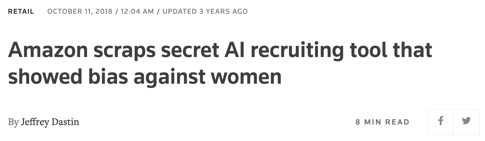

class: inverse

```{r setup, include=FALSE}
options(htmltools.dir.version = FALSE)
knitr::opts_chunk$set(fig.retina = 3, warning = FALSE, message = FALSE)
options(knitr.table.format = "html")
```

```{r xaringan-themer, include=FALSE, warning=FALSE}
library(xaringanthemer)
style_duo_accent(
  primary_color = "#2d708e",
  secondary_color = "#230433",
  link_color = "#55c667",
  text_bold_color = '#f68f46',
  title_slide_text_color = "#111111",
  title_slide_background_color = "#ffffff", #"#042333",
  title_slide_background_image = "https://cdn.vox-cdn.com/thumbor/eRYfQL3wM_LXvgAwR57_4qsE4uA=/0x0:4656x3104/1200x800/filters:focal(520x716:1264x1460)/cdn.vox-cdn.com/uploads/chorus_image/image/55292787/629851774.0.jpg",
  title_slide_background_size = "cover",
  ) #or contain
```

```{r xaringanextra, include=FALSE, warning=FALSE}
library(xaringanExtra)
#xaringanExtra::use_animate_all("slide_left")
xaringanExtra::use_tile_view()
xaringanExtra::use_panelset()
xaringanExtra::style_panelset_tabs(font_family = "inherit")
```

```{r tidyverse, include=FALSE, warning=FALSE}
library(tidyverse)
library(knitr)
theme_set(theme_minimal(base_size = 22))
set.seed(1)
library(broom)
library(modelr)
```

<style type="text/css">
.remark-slide-content {
    font-size: 1.2rem;
    padding: 1em 4em 1em 4em;
}
</style>

# Outline

### Intro to AI

Motivating examples showing racial bias

### Useful concepts

Fairness, biased data, biased models, biased systems

### Actions

Tech "solutions," inclusion, democratization, power

---
class: inverse

# What is AI?

(this might be the most controversial part of the talk)

$$
\text{AI} \approx \text{machine learning} \approx \text{regression}
$$

Predictions from lots of "similar" examples. From [Stanford](http://cs231n.stanford.edu/):


---


"Examples" don't have to be images, this generalizes to anything that can be measured and transformed into data

---

## Historical

### Early computer era (~50 years ago)

Regression (prediction recipe) -- decision trees -- low dimensional smoothing

### Internet era (~20 years ago)

Machine learning -- "black box" (more complex) algorithms

### Big data, 3rd wave of AI (~10 years ago)

Network architecture (depth) -- datafication of images, etc

---

### Classic methods

#### Regression

- Predictor variables in the dataset: $x_1, x_2, \ldots, x_p$
- Coefficients/**parameters**, unknown: $\beta_1, \beta_2, \ldots, \beta_p$
- Outcome variable, also in data: $y$
- Algorithm inputs the data, outputs: estimated parameters, predictions of $y$ using "recipe" or "weighted" combination

$$
\beta_1 x_1 + \beta_2 x_2 + \cdots + \beta_p x_p
$$

#### Decision trees (e.g. vaccine eligibility in the UK)

- If `Age >= 40` then `yes`, otherwise `continue`
- If `HighRisk == TRUE` then `yes`, otherwise `continue`
- If `Job == CareWorker` then `yes`, otherwise `no`

---

### Present day methods

.pull-left[

]
.pull-right[
From [Computer Age Statistical Inference](https://web.stanford.edu/~hastie/CASI/):

]

Non-linear, deep (multiple) composition of functions


---

## Consistent trends

- Larger datasets, faster computation, more parameters

1801: [Gauss's](https://sites.math.rutgers.edu/~cherlin/History/Papers1999/weiss.html) first use of regression, ~5 parameters

2000s: models with ~thousands of parameters (e.g. [lasso](https://pubmed.ncbi.nlm.nih.gov/?term=lasso+regression))

2012: image model [AlexNet](https://en.wikipedia.org/wiki/AlexNet) uses ~61 million parameters

2020: language model [GPT-3](https://en.wikipedia.org/wiki/GPT-3) uses ~175 billion parameters


- Focus on improving prediction accuracy, sacrifice explainability to (non-expert) human audiences

- More categories of things analyzed as data

- More kinds of tasks "automated" (possibly: outsourced)

---

### Dangers of opacity

[Reuters](https://www.reuters.com/article/us-amazon-com-jobs-automation-insight-idUSKCN1MK08G), in 2018:



> Amazon’s system **taught itself** that male candidates were preferable. It penalized resumes that included the word “women’s,” as in “women’s chess club captain.” And it downgraded graduates of two all-women’s colleges, according to people familiar with the matter.


---

### Auditing opaque models: accuracy

From the [Gender shades](http://gendershades.org/) project


---
class: inverse, center, middle


---

# More motivating examples

Slides on

- Health: Obermeyer et al
- Policing: Lum and Isaacs, ProPublica
- Consumption: Amazon
- Labor: ghost work?
- Environment: e.g. cobalt extraction, also labor

(anatomy of AI / global picture)

---

### Pre-trial detention risk scores

.pull-left[

]
.pull-right[


]

---

The [hope](https://www.kqed.org/education/507247/can-algorithms-help-wind-down-mass-incarceration): could more accurate risk assessments reduce incarceration, and maybe even reduce racial bias?

The reality: proprietary, opaque algorithms


- Multibillion-dollar bail industry spent $10 million opposing

- Did voters understand what these algorithms would do?

---

"Algorithm does not *explicitly* use race" -- in an unfair system other things can correlate with race, e.g. previous convictions. From [Lum and Isaac (2016)](https://rss.onlinelibrary.wiley.com/doi/full/10.1111/j.1740-9713.2016.00960.x)

---

.pull-left[

]

.pull-right[

]

---

### (Sampling) bias in healthcare patient data

.pull-left[


]
.pull-right[

[Obermeyer et al (2019)](https://science.sciencemag.org/content/366/6464/447.editor-summary)

- Algorithm assigns risk scores by **predicting healthcare costs** from patient records
- Underestimates risk of health conditions for black patients compared to white patients
- **Adjusting algorithm** to close the gap results in ~2.5x black patients receiving more care

]

---

Scaling up: cheaper, faster, maybe more accurate than humans

Tech solution: maybe fairer than humans

Key drawback: maybe *this task should not be scaled up* (or done at all)?

---

.pull-left[

]
.pull-right[

]

---

How to think like a statistician about AI

- Model is always wrong
- Data is (almost) always biased
- Measurement

---

edit this

### Interventions, counterfactuals, thought experiments

- Pearl's [ladder of causation](https://en.wikipedia.org/wiki/Causal_model#Ladder_of_causation) level 2

Intervention, action, manipulation, policy change

*What will (or is more likely to) happen if...*

- But we can also go to level 3

Counterfactuals, potential histories(?)

*What would have (been more likely to have) happened if...*

- Thought experiments

Models as thinking tools, *over-simplified models as diagnostics for more realistic ones*

---

### Statistical wisdom: models as (thinking) tools

.pull-left[

[George Box](https://en.wikipedia.org/wiki/George_E._P._Box)
]

.pull-right[

> [All models are wrong](All_models_are_wrong) but some are useful

therefore,

> ... the scientist must be alert to what is **importantly wrong**

> ... **cannot obtain a "correct" one** by excessive elaboration

]

---

What's **important** and what's **useful**?

- to who?
- for what?

---
class: inverse

# Changing the world

There are real opportunities to make *fast/cheap* progress by changing algorithms

But we should not neglect more important actions

- Democratizing data
- Decolonial AI
- Irwin Bross: scientist or shoe clerk? Need professional organization to back up an individual (data) scientist so they can act on conscience

---

https://www.ictworks.org/barriers-data-sharing-african-artificial-intelligence-solutions/#.YJF6csCSk2w

---

## Regulation

Public/worker desire for regulation https://www.cnet.com/news/even-silicon-valley-workers-want-more-regulation-of-the-tech-industry/

Potential drawbacks: legal/technical arms races, regulatory capture

(necessary but not sufficient)

---

- [Black in AI](https://blackinai.github.io/#/about) founded in 2017
- Examples of tech workers organizing
- Examples of gig workers organizing

Obstacles: opposition, knowledge

Google firing AI ethics researchers


---

Changing the objective function

https://en.wikipedia.org/wiki/Twelve_leverage_points

